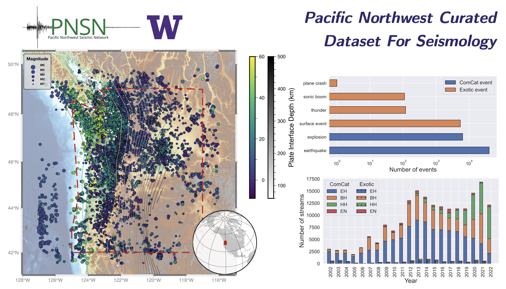

# Pacific Northwest Curated Seismic Dataset
[](https://zenodo.org/badge/latestdoi/470042054) [](https://opensource.org/licenses/MIT)
## A ML-ready curated data set for a wide range of sources from the Pacific Northwest.



## Overview
Each dataset has two files: waveform and metadata. All follow the structure of [seisbench format](https://seisbench.readthedocs.io/en/latest/). See [here](https://seisbench.readthedocs.io/en/latest/pages/data_format.html) to learn more about the  file structure. Download using the link below. Note that you may access the data directly from Google Colab. See `Google Colab` section below.

## Datasets
We are making two copies of the raw dataset: one on Google Drive, another on UW ESS server. Choose the one that gives you the best download performance. The ComCat dataset is also available through [SeisBench](https://github.com/seisbench/seisbench).

### 1. ComCat Events
- EH, BH, and HH channel (velocity)
  - waveform (62.7 GB): [[GDrive](https://drive.google.com/file/d/10UCLyJSRibvhon9CuUTfns3fObNFKDer/view?usp=sharing)] | [[UW-ESS](https://dasway.ess.washington.edu/niyiyu/PNW-ML/comcat_waveforms.hdf5)]
  - metadata (50.4 MB): [[GDrive](https://drive.google.com/file/d/1bKDITx8KiDGZUaUoWQSZilpo7GhdWxKv/view?usp=sharing)] | [[UW-ESS](https://dasway.ess.washington.edu/niyiyu/PNW-ML/comcat_metadata.csv)]

- EN (accelerometer)
  - waveform (2.1 GB): [[GDrive](https://drive.google.com/file/d/1I16psU3YJ7CFFNWZiaAGPlw1M3BmvuT8/view?usp=sharing)] | [[UW-ESS](https://dasway.ess.washington.edu/niyiyu/PNW-ML/accelerometer_waveforms.hdf5)]
  - metadata (1.7 MB): [[GDrive](https://drive.google.com/file/d/1xpeaoC3NsZqyICIbNHF2J46WsfZwwF6K/view?usp=sharing)] | [[UW-ESS](https://dasway.ess.washington.edu/niyiyu/PNW-ML/accelerometer_metadata.csv)]

### 2. Noise Waveform (EH, BH, and HH)
  - waveform (~18 GB): [[GDrive](https://drive.google.com/file/d/1Z55WTcoyy-bR-WwWbedlZJrSo6tkRLlJ/view?usp=sharing)] | [[UW-ESS](https://dasway.ess.washington.edu/niyiyu/PNW-ML/noise_waveforms.hdf5)]
  - metadata (4.9 MB): [[GDrive](https://drive.google.com/file/d/1Ou5AKRczEqnNRsSEUSafIRlGcXTvLLUW/view?usp=sharing)] | [[UW-ESS](https://dasway.ess.washington.edu/niyiyu/PNW-ML/noise_metadata.csv)]
  
### 3. Exotic Events (EH, BH, and HH)
  - waveform (3.9 GB): [[GDrive](https://drive.google.com/file/d/1pxGQnLnAwXf9Zhc8xfh1HXEOsXjga2sG/view?usp=sharing)] | [[UW-ESS](https://dasway.ess.washington.edu/niyiyu/PNW-ML/exotic_waveforms.hdf5)]
  - metadata (1.4 MB): [[GDrive](https://drive.google.com/file/d/1brCZkrKjRtToLxBX5ob7qHX6EBq00nAM/view?usp=sharing)] | [[UW-ESS](https://dasway.ess.washington.edu/niyiyu/PNW-ML/exotic_metadata.csv)]

### 4. Northern California Sequence (December 2022)
  - waveform (346 MB): [[GDrive](https://drive.google.com/file/d/15UxIbxacloPlY2DUTDBEnBaMYvh2eXVI/view?usp=sharing)] | [[UW-ESS](https://dasway.ess.washington.edu/niyiyu/PNW-ML/norcal_waveforms.hdf5)]
  - metadata (126 KB): [[GDrive](https://drive.google.com/file/d/1BhLVODzlu407JDZ0OteoPgZlTE-o469O/view?usp=sharing)] | [[UW-ESS](https://dasway.ess.washington.edu/niyiyu/PNW-ML/norcal_metadata.csv)]

### 5. ML-enhanced catalog
  - CSV (~93 MB): [[GDrive](https://drive.google.com/file/d/16qUT_3-duVuKwfmPmvtH5EifL4eeyRvv/view?usp=sharing)] 


## A quick tour to dataset
Here are several ways to check or use PNW dataset quick.

1. Jupyter Notebook
   
  A jupyter notebook is available to load and plot PNW dataset at [here](./notebooks/inspect_pnw_dataset.ipynb). Download and run it on a local machine to enable the interactive plotting (e.g., zoom in/out for checking the picks). You would need to download the full dataset to the local.

2. Google Colab [](https://colab.research.google.com/drive/17Qu54ZI_HxJjIgLgo9K18-vwpXWoIeYM?usp=sharing)

  If you are more familiar with Google Colab, go to the link above. Note that interactive plotting is not available on Colab.

3. We also provide a mini version of the dataset, which contains 500 earthquake streams, 500 explosion streams, 500 surface event streams, 126 sonic boom streams, and 94 thunder quake streams.
  - waveform (640 MB): [[Google Drive](https://drive.google.com/file/d/1jIZP96p3bBDJGXMp73Dlh4zTaSjjilaB/view?usp=sharing)] | [[UW-ESS](https://dasway.ess.washington.edu/niyiyu/PNW-ML/miniPNW_waveforms.hdf5)]
  - metadata (424 KB): [[Google Drive](https://drive.google.com/file/d/1F_A91-WmBSVbLS8YyxMrJhAIS_2w04-T/view?usp=sharing)] | [[UW-ESS](https://dasway.ess.washington.edu/niyiyu/PNW-ML/miniPNW_metadata.csv)]

## Metadata
| Attribute | Description | Example |
| ----------- | ----------- |-------|
| event_id | Event identifier | uw10564613 |
| source_origin_time | Source origin time in UTC | 2002-10-03T01:56:49.530000Z |
| source_latitude_deg | - | 48.553 |
| source_longitude_deg | - | -122.52 |
| source_type | - | earthquake |
| source_type_pnsn_label | PNSN AQMS event type | eq |
| source_depth_km | - | 14.907 |
| source_magnitude_preferred | - | 2.1 |
| source_magnitude_type_preferred | - | Md |
| source_magnitude_uncertainty_preferred | - | 0.03 |
| source_local/duration/hand_magnitude | Ml, Md, and Mh if available | 1.32 |
| source_local/duration_magnitude_uncertainty | magnitude uncertainty if available | 0.15 |
| source_depth_uncertainty_km | - | 1.69 |
| source_horizontal_uncertainty_km | - |0.694 |
| station_network_code | FDSN network code | UW |
| station_code | FDSN station code | GNW |
| station_location_code | FDSN location code | 01 |
| station_channel_code | FDSN channel code (first two digits) | BH |
| station_latitude_deg | - | 47.5641 |
| station_longitude_deg | - | -122.825 |
| station_elevation_m | - | 220.0 |
| trace_name | Bucket and array index | bucket1\$0,:3:15001 |
| trace_sampling_rate_hz | All traces resampled to 100 Hz | 100 |
| trace_start_time |  Trace start time in UTC | 2002-10-03T01:55:59.530000Z |
| trace_P/S_arrival_sample | Closest sample index of arrival  | 8097 |
| trace_P/S_arrival_uncertainty_s | Picking uncertainty in second |  0.02 |
| trace_P/S_onset | - |  emergent |
| trace_P_polarity | P-wave onset polarity | positive, negative, or undecidable |
| trace_has_offset | Any visible offset in the trace | 1 |
| trace_missing_channel | Number of missing channel of the trace | 2 |
| trace_snr_db | SNR for each component |  6.135|3.065|11.766 |

## Reference
Ni, Y., Hutko, A., Skene, F., Denolle, M., Malone, S., Bodin, P., Hartog, R., & Wright, A. (2023). Curated Pacific Northwest AI-ready Seismic Dataset. *Seismica*, 2(1). https://doi.org/10.26443/seismica.v2i1.368

BiBTex:
```bibtex
@article{Ni_Hutko_Skene_Denolle_Malone_Bodin_Hartog_Wright_2023, 
  title   = {Curated Pacific Northwest AI-ready Seismic Dataset}, 
  volume  = {2}, 
  url     = {https://seismica.library.mcgill.ca/article/view/368}, 
  number  = {1}, 
  journal = {Seismica}, 
  author  = {Ni, Yiyu and Hutko, Alexander and Skene, Francesca and Denolle, Marine and Malone, Stephen and Bodin, Paul and Hartog, Renate and Wright, Amy}, 
  year    = {2023}, 
  month   = {May},
  doi     = {10.26443/seismica.v2i1.368}, 
}
```

## Report bugs
If you find anything wrong with this dataset, please create an Issue at https://github.com/niyiyu/PNW-ML/issues or send me an email (niyiyu@uw.edu)